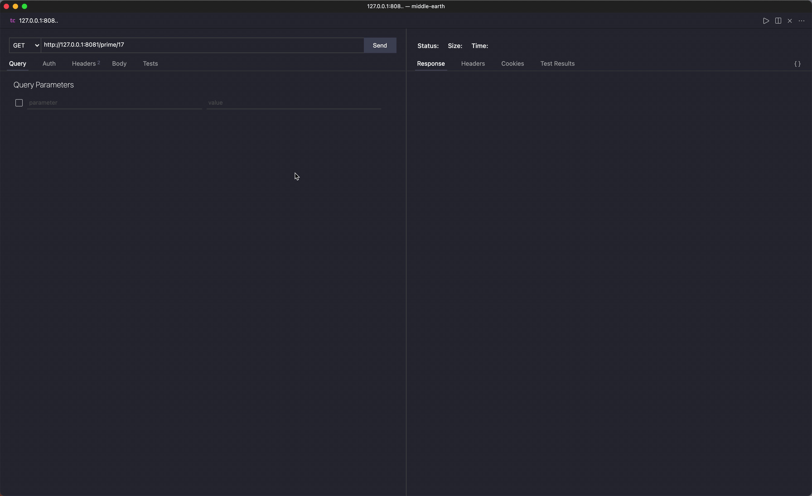

# Welcome to Middle-earth

An client and server applications showcasing Streaming of prime numeric values from a GRPC server.

## Components

mordor - `prime-number-server` A GRPC service that produce prime numbers up to the given value

gondor - `proxy-service` A http streaming service that is exposed to clients, and accepts a numeric value which being forward to mordor service

protobuf - GRPC contract protocol used by both services to communicate to each other

## Technology stack

- Scala - main programing language used
- cats - functional library abstraction
- Http4s - Http web service library
- fs2.Streams - Streaming process library
- fs2 grpc - grpc implementation built on top of cats and fs2
- munit - unit test library
- pureConfig - typed configuration sourcing library

## High level overview

```docs
    Internet                 Gondor                                    Mordor
               | Endpoint -> Service -> Repository --┐             |
 clients  <->  |                                     |-->  grpc <--|  mordor.Service
               | Endpoint <- Service <- Repository <-┘             |
```

### Endpoint

layer that is responsible for receiving and serving http request and response

### Service

layer that is responsible for any business logic of the application(e.g change of sequence of call, some validation etc)

### Repository

layer responsible for communication and other activities related to the external modules.

### grpc

protocol used to communicate both gondor and mordor service

### mordor.Service

layer responsible for the computation related to the request

## Mordor

Mordor `prime-number-server`, is responsible for prime number generation that is requested by Client. It's main function is to abstract any computation away from the proxy server a.k.a Gondor in a streaming fashion.

### Sample request

```curl
grpcurl -d '{"maxNumberRange":"17"}' -plaintext \
-import-path protobuf/src/main/protobuf -proto prime.proto \
127.0.0.1:9999 com.service.PrimeNumberService/GeneratePrimeNumber
```

### How to run Mordor

```shell
sbt mordor
```

## Gondor

Gondor `proxy-service`, is a responsible for accepting request and response from clients, and apply any necessary basic validation that can be extracted away from Mordor, and serving the response back to clients in a streaming fashion.

### Api exposed

- `/prime/:intValue`
  - strictly accepts positive numeric value only
- `/prime/v2/:intValue` - [Optional solution]
  - accepts any numeric value, however gives you a response if fails the validation

### Sample request

request:

```curl
curl -v GET 'http://127.0.0.1:8081/prime/17'
```

response:

```shell
* Connected to 127.0.0.1 (127.0.0.1) port 8081 (#1)
> GET /prime/17 HTTP/1.1
> Host: 127.0.0.1:8081
> User-Agent: curl/7.64.1
> Accept: */*
>
< HTTP/1.1 200 OK
< Content-Type: text/plain; charset=UTF-8
< Date: Thu, 15 Jul 2021 12:01:00 GMT
< Transfer-Encoding: chunked
<
* Connection #1 to host 127.0.0.1 left intact
2,3,5,7,11,13,17
```

_NOTE: response should be compressed with `GZip`, However Curl is not showing it, However its in demo below._

### How to run Gondor

```shell
sbt gondor
```

## Create docker images

to create a gondor docker image

```shell
sbt dockerGondor
```

to create a mordor docker image

```shell
sbt dockerMordor
```

## Running docker images

```docker
# docker run --rm -p 9999:9999 --name mordor <docker id/name>
# e.g
docker run --rm -p 9999:9999 --name mordor e9ab442f5b6d
```

```docker
# docker run --rm -p 8081:8081 --name gondor <docker id/name>
# e.g
docker run --rm -p 8081:8081 --name gondor e9ab442f5b6d
```

## Run tests

to run all gondor unit tests

```shell
sbt testGondor
```

to run all mordor unit tests

```shell
sbt testMordor
```

## Implementation

The tools and libraries I chosen and picked were mainly because of my taste and what I know that will do the job, and my likeness on working in a functional code base.

As everything is expressed in functional way (I hope), It would be easy to comprehend with the code, extract/change/modify any business request.

Also testing every layer is much easier since most of the function are pure, and we are sure that ever operation are executed at the end of the world.

Why I choose fs2.Stream over other? Aside from its being a purely functional streaming, For me its a great fit to the ecosystem since fs2.stream is the heart of http4s, I say integration is easy. aside from that since we are serving clients on the internet having a pull based stream on this requirement is much more fitting to avoid any network and buffer overload.

## Technology alternatives

Scala - Alternatively we can use any programming language/libraries that fits us, and with rich GRPC support such as (Go, Node[type-script/javascript], Java, Rust etc).

cats - ZIO, scalaZ

Http4s - Akka Http, ZIO Http

Fs2.Streams - Akka Streams, Zio Http

Fs2 Grpc - Akka GRPC

Munit - Scala test, Spec2

PureConfig - Typesafe config

## Improvements and recommendation

- Pipeline/Action creation for CI.

- Separation of mono this repo on a 3 different repositories to have a parallel development.

- Enrich unit tests with more assertions and cases for both services.

- Enhance test using property-based testing libraries such as ScalaCheck etc.

- Create a black box/functional testing.

- Give some love on the Mordor code base.

- Create a web app (probably built on react/vue:type-script) for better stream response representation.

- add logging libraries such as log4cats etc

- Apply Authentication and Authentication Layer on both Gondor and Mordor Services

  - TLS
  - Session based/Cookie based

## Demo


